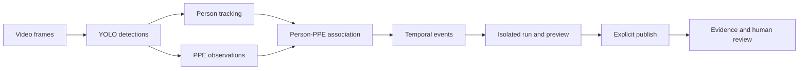

<div align="center">

# PPE Monitoring

**Video-based person tracking, PPE association, and reviewable safety events.**

An application-oriented computer vision project by Team 15.

[Getting started](docs/QUICKSTART.md) · [Architecture](docs/architecture.md) · [CLI reference](docs/CLI.md) · [Testing](docs/TESTING.md) · [Tiếng Việt](docs/QUICKSTART_VI.md)

</div>

---

PPE Monitoring connects object detections across video frames, associates helmets
and safety vests with people, and produces events that an operator can inspect.
It includes dataset preparation, model-training workflows, inference, experiment
logging, and a local review application.

**Current scope:** a research/application prototype. The unified code is on
`main_sub`; the original module implementations remain available in one checkout.
This is not a certified safety system or a production deployment.

## What the project does

- **Detect four classes:** person, bare head, helmet, and vest.
- **Track people:** maintain IDs across frames using ByteTrack.
- **Associate PPE:** attach detected head/helmet/vest observations to a person.
- **Process temporal events:** distinguish transient observations from event candidates.
- **Review results:** inspect video jobs, evidence, and human review decisions.
- **Reproduce experiments:** preserve dataset mappings, configurations, reports, and optional W&B logs.

The final training package documents YOLO26L. The runtime consumes external,
compatible four-class checkpoints; a file named best.pt is not sufficient
evidence of its architecture, dataset, or quality.

## System overview



This diagram describes the **review application**. Standalone Association and
the research Event Engine are retained as separate runtimes; their policies
are not interchangeable. [Read the runtime boundaries](docs/architecture.md).

## Choose a workflow

| I want to… | Start here | Command |
| --- | --- | --- |
| Process videos and review events | [Review application](docs/QUICKSTART.md#review-application) | `python ppe.py review-api` + `dashboard` |
| Run an isolated video experiment | [Video inference](docs/QUICKSTART.md#video-inference) | `python ppe.py infer --help` |
| Inspect person-to-PPE association | [Variant C](README_VARIANT_C.md) | `python ppe.py association --help` |
| Run research A–D profiles | [Research runtime](docs/EVENT_ENGINE.md) | `python ppe.py event-video --help` |
| Convert and validate CHVG labels | [Dataset guide](data/README.md) | `python ppe.py convert --help` |
| Train or reproduce the final model | [Training guide](docs/TRAINING_PATHS.md) | Choose the appropriate training workflow |
| Check a contribution | [Testing](docs/TESTING.md) | `python ppe.py test -q` |

## Quick start

### 1. Get the unified branch

```sh
git clone --branch main_sub https://github.com/volethanhtrieu/YOLOv26_PPE_project_team_15.git
cd YOLOv26_PPE_project_team_15
```

Already have the repository? Preserve uncommitted work before switching branches.
Do not paste the clone commands inside an existing checkout.

### 2. Create an environment

For a fresh setup, use Python 3.11 or 3.12 and start from the repository root.

**Windows PowerShell**

```powershell
python -m venv .venv
.\.venv\Scripts\Activate.ps1
python -m pip install --upgrade pip
python -m pip install -r requirements-dev.txt
```

**Linux / macOS**

```sh
python3 -m venv .venv
source .venv/bin/activate
python -m pip install --upgrade pip
python -m pip install -r requirements-dev.txt
```

Ultralytics is pinned to 8.4.104. PyTorch/device setup depends on the machine;
the runtime environment and the training container are separate workflows.
OS-specific clean-install coverage is described in [testing](docs/TESTING.md).

### 3. Verify the checkout

```sh
python ppe.py test -q
python ppe.py --help
```

These tests require no dataset, weights, or W&B account. Model/video inference
requires additional local inputs.

### 4. Start the review application

```sh
python ppe.py review-api
```

In another terminal with the same environment:

```sh
python ppe.py dashboard
```

Open **http://localhost:8501**. Set the dashboard API URL to
**http://127.0.0.1:5000**.

No published data is present in a fresh clone: the review health endpoint
intentionally reports 503 until its published store is ready. This does not
prevent starting the UI. See [troubleshooting](docs/TROUBLESHOOTING.md).

Before submitting a dashboard job, supply the checkpoint at
`bytetrack_ppe/weights/candidates/CHVG4-best.pt`. Jobs currently use runner
defaults; there is no model/device selector in the UI.

### 5. Process a video

Obtain a trusted checkpoint separately. Example paths below are placeholders:

```powershell
python ppe.py infer --video "C:\videos\site.mp4" --model "C:\models\ppe-4class.pt" --device cpu --run-name site-check-01
```

Use absolute input paths because the launcher selects the working directory
for each runtime. This command creates an isolated run; it does **not** publish
or upload it. W&B logging is opt-in through the separate `wandb` command.
CLI runs are inspected through their output files; they are not automatically
registered as dashboard jobs.

## Data and model contract

| Class ID | Name | Meaning |
| ---: | --- | --- |
| 0 | person | Person/worker |
| 1 | head | Visible bare or unhelmeted head |
| 2 | helmet | Helmet/hard hat |
| 3 | vest | Safety/high-visibility vest |

The converter supports the original CHVG mapping: blue/red/white/yellow → helmet,
glass → remove, person/head/vest → canonical IDs. It preserves image content,
bounding-box coordinates, and split membership during conversion.

Images, annotations, weights, videos, and databases are not bundled. The
historical five-class preparation stage is documented separately from final
four-class inference. [Dataset versions and provenance](data/README.md).

## Outputs and experiment interpretation

| Workflow | Output location | Main artifacts |
| --- | --- | --- |
| Review inference | `bytetrack_ppe/outputs/runs/<run-name>/` | Annotated video, tracking CSV, frame metrics, temporal states, event JSON/CSV |
| Review jobs | `bytetrack_ppe/outputs/jobs/` | Job state and processing logs |
| Standalone Association | `outputs/` | Association video and JSONL |
| Research video | `outputs/`, `logs/`, `evidence/`, `data/detections.db` | Video, violation log, evidence, SQLite |

FPS, latency, detection counts, and unique track counts describe a run; they
do not establish accuracy. Model metrics, tracking metrics, and event metrics
require different ground truth and evaluation protocols.

The integration record contains local test results and short real-model smoke
runs. It is not a long-video benchmark. [Verification scope](docs/TESTING.md).

## Repository map

```text
.
├── ppe.py                    # Shared launcher
├── bytetrack_ppe/            # Review runtime, jobs, evidence and human review
├── src/variant_c/            # Standalone association backend
├── backend/                 # Research Event Engine and SQLite runtime
├── scripts/                 # Data, training and validation entry points
├── configs/                 # Dataset/configuration files
├── experiments/training/    # Reproducible final-training package
├── tests/                   # Offline regression tests
├── docs/                    # Setup, architecture, commands and testing
├── reports/                 # Historical reports and provenance
└── archive/                 # Unsupported historical prototype
```

## Contributing and project status

Use [CONTRIBUTING.md](CONTRIBUTING.md) for setup, change scope, tests, and PR
requirements. Bug reports should include a reproducible command and sanitized
configuration; never attach credentials or private video without permission.

- [Documentation index](docs/README.md)
- [Changelog](CHANGELOG.md)
- [Integration provenance](docs/INTEGRATION.md)
- [Security and safe operation](SECURITY.md)

The team has not selected a repository-wide license in this branch. Do not
assume a permissive license; source code, model weights, and datasets require
separate licensing review. See the existing [licensing checklist](experiments/training/docs/LICENSING.md).

**Team 15:** Võ Lê Thành Triệu · Nguyễn Huỳnh Nam Quốc · Nguyễn Cáp Quốc Khánh ·
Tạ Tuấn Khải · Nguyễn Minh Phúc.
